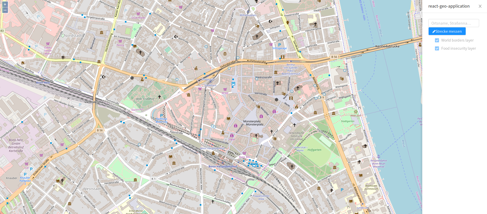

# Summary

Congratulations! You finished the react-geo-workshop!

In this workshop you learned to setup your first react-based application. Through the addition of different react-geo components such as `MapComponent`, `NominatimSearch` and `MeasureButton` you made the step from a simple `Hello World` to a fully fledged map application.

Your complete application should look something like this:

[](../screenshots/summary.png)

And here is the complete source code:

```javascript
import React, { Component } from 'react';

import './App.css';
import 'ol/ol.css';
import 'antd/dist/antd.css';
import './react-geo.css';

import OlMap from 'ol/Map';
import OlView from 'ol/View';
import OlLayerTile from 'ol/layer/Tile';
import OlSourceOsm from 'ol/source/OSM';
import OlSourceTileJson from 'ol/source/TileJSON';
import OlLayerGroup from 'ol/layer/Group';

import { Drawer } from 'antd';
import {
  SimpleButton,
  MapComponent,
  NominatimSearch,
  MeasureButton,
  LayerTree,
  MapProvider,
  mappify,
  onDropAware
} from '@terrestris/react-geo';

const MappifiedNominatimSearch = mappify(NominatimSearch);
const MappifiedMeasureButton = mappify(MeasureButton);
const MappifiedLayerTree = mappify(LayerTree);
const Map = mappify(onDropAware(MapComponent));

const layer = new OlLayerTile({
  source: new OlSourceOsm(),
  name: 'OSM'
});

const layerGroup = new OlLayerGroup({
  name: 'Layergroup',
  layers: [
    new OlLayerTile({
      name: 'Food insecurity layer',
      minResolution: 200,
      maxResolution: 2000,
      source: new OlSourceTileJson({
        url: 'https://api.tiles.mapbox.com/v3/mapbox.20110804-hoa-foodinsecurity-3month.json?secure',
        crossOrigin: 'anonymous'
      })
    }),
    new OlLayerTile({
      name: 'World borders layer',
      minResolution: 2000,
      maxResolution: 20000,
      source: new OlSourceTileJson({
        url: 'https://api.tiles.mapbox.com/v3/mapbox.world-borders-light.json?secure',
        crossOrigin: 'anonymous'
      })
    })
  ]
});

const center = [ 788453.4890155146, 6573085.729161344 ];

const map = new OlMap({
  view: new OlView({
    center: center,
    zoom: 16,
  }),
  layers: [layer, layerGroup]
});

map.on('postcompose', map.updateSize);

class App extends Component {
  state = {visible: false};

  toggleDrawer = () => {
    this.setState({visible: !this.state.visible});
  }

  render() {
    return (
      <div className="App">
        <MapProvider map={map}>
          <Map/>
          <Drawer
            title="react-geo-application"
            placement="right"
            onClose={this.toggleDrawer}
            visible={this.state.visible}
            mask={false}
          >
            <MappifiedNominatimSearch
              key="search"
            />
            <MappifiedMeasureButton
              key="measureButton"
              name="line"
              measureType="line"
              icon="pencil"
            >
              Strecke messen
            </MappifiedMeasureButton>
            <MappifiedLayerTree
              layerGroup={layerGroup}
            />
          </Drawer>
          <SimpleButton
            style={{position: 'fixed', top: '30px', right: '30px'}}
            onClick={this.toggleDrawer}
            icon="bars"
          />
        </MapProvider>
      </div>
    );
  }
}

export default App;
```

This workshop is licensed under the [CC BY-SA](http://creativecommons.org/licenses/by-sa/2.0/) license. In case of questions, feel free to contact us via GitHub [@terrestris](https://github.com/terrestris) or telephone 0228 – 962 899 51.